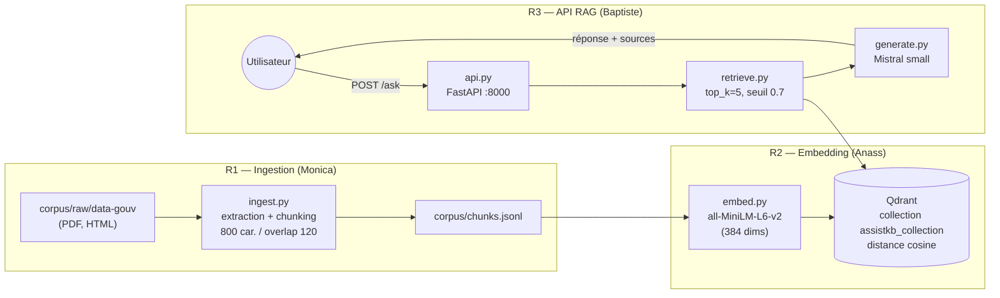

# Compte Rendu — BAMN-TP

## 1. Présentation

**Équipe : BAMN** (Baptiste, Anass, Monica, Nassim)

| Membre   | Rôle                                                                  |
|----------|-----------------------------------------------------------------------|
| Monica   | R1 — Ingestion : extraction du corpus, nettoyage, chunking (`app/ingestion/`) |
| Anass    | R2 — Embedding : vectorisation et indexation Qdrant (`app/embedding/`) |
| Baptiste | R3 — API & Génération : `app/api.py`, `app/retrieve.py`, `app/generate.py` |
| Nassim   | R4 — DevOps / Containerisation : Dockerfiles, `docker-compose.yml`, documentation |

**Projet choisi :** Projet A — corpus documentaire data.gouv

**Lien GitHub :** [https://github.com/NassJs/BAMN-TP](https://github.com/NassJs/BAMN-TP)

## 2. Objectif

Notre RAG (Retrieval-Augmented Generation) est un assistant documentaire qui répond à des questions en français en s'appuyant **uniquement** sur un corpus de documents publics issus de data.gouv (PDF, HTML). Le besoin métier : permettre à un utilisateur d'interroger en langage naturel une base documentaire administrative sans avoir à lire les documents sources, tout en garantissant des réponses **sourcées** (citation des documents utilisés) et **sans hallucination** (si l'information n'est pas dans le corpus, l'assistant répond explicitement "Information non trouvée dans la documentation").

## 3. Architecture



Le tout est orchestré par **Docker Compose** (R4 — Nassim) : 4 services isolés (`qdrant`, `ingestion`, `embedding`, `api`), chacun avec sa propre image, et le dossier `corpus/` partagé en volume entre ingestion et embedding.

### Composants et interactions

1. **Ingestion** lit les documents bruts, les découpe en chunks et écrit `corpus/chunks.jsonl`.
2. **Embedding** lit ce fichier, vectorise chaque chunk avec `sentence-transformers` et insère les vecteurs + métadonnées dans **Qdrant**.
3. **L'API** reçoit une question, la vectorise avec le même modèle, interroge Qdrant, filtre par score de similarité, puis fait générer la réponse par le LLM **Mistral** à partir des seuls chunks retrouvés.

## 4. Fonctionnement — parcours d'une question

1. L'utilisateur envoie `POST /ask` avec `{"question": "..."}` à l'API FastAPI (port 8000).
2. `retrieve.py` encode la question avec **all-MiniLM-L6-v2** (le même modèle que celui utilisé à l'indexation — condition indispensable pour que la comparaison ait un sens).
3. Le vecteur de la question est envoyé à **Qdrant** (`query_points`), qui retourne les **5 chunks les plus proches** en similarité cosine.
4. Les résultats sous le **seuil de 0.7** sont écartés : on préfère ne rien répondre que répondre à côté.
5. S'il ne reste aucun chunk, la réponse est directement *"Information non trouvée dans la documentation."* — sans appel au LLM.
6. Sinon, `generate.py` construit un prompt contenant : les règles (répondre uniquement à partir du contexte, en français, citer les sources), le **contexte** (texte des chunks + leur source) et la **question**.
7. Le prompt est envoyé à **Mistral** (`mistral-small-latest`), qui rédige la réponse en citant ses sources.
8. L'API renvoie la réponse avec la liste dédupliquée des documents sources utilisés.

## 5. Structure du projet

```
BAMN-TP/
├── docker-compose.yml          # Orchestration des 4 services (R4)
├── .env                        # Clés API (non versionné)
├── corpus/
│   ├── raw/data-gouv/          # Documents bruts en entrée (PDF, HTML)
│   └── chunks.jsonl            # Sortie de l'ingestion / entrée de l'embedding
├── app/
│   ├── Dockerfile              # Image de l'API (R4)
│   ├── requirement.txt         # Dépendances API (fastapi, mistralai, ...)
│   ├── api.py                  # API FastAPI : endpoints / et /ask (R3)
│   ├── retrieve.py             # Recherche vectorielle + filtre par seuil (R3)
│   ├── generate.py             # Construction du prompt + appel Mistral (R3)
│   ├── ingestion/
│   │   ├── Dockerfile          # Image du service d'ingestion (R4)
│   │   ├── requirements.txt    # bs4, pypdf, langdetect, langchain-text-splitters
│   │   └── ingest.py           # Extraction, nettoyage, chunking (R1)
│   └── embedding/
│       ├── Dockerfile          # Image du service d'embedding (R4)
│       ├── requirements.txt    # sentence-transformers, qdrant-client
│       ├── embed.py            # Vectorisation par batch + insertion Qdrant (R2)
│       ├── store.py            # Adaptateur Qdrant (connexion, collection, upsert, search) (R2)
│       └── search.py           # CLI de test de la recherche (R2)
├── script/                     # Scripts de récupération du corpus (R1)
└── docs/                       # Documentation (ce compte rendu)
```

## 6. Choix techniques

| Brique | Choix | Pourquoi |
|--------|-------|----------|
| **Vector store** | Qdrant | Open source, image Docker officielle prête à l'emploi, API Python simple, dashboard web intégré pour vérifier visuellement l'indexation. Suffisant pour notre volumétrie (pas besoin d'un cluster type Milvus). |
| **Modèle d'embeddings** | `all-MiniLM-L6-v2` (384 dims) | Léger (~80 Mo), rapide sur CPU (pas de GPU disponible), tourne en local sans clé API. Arbitrage assumé : qualité un peu moindre qu'un gros modèle, mais itérations beaucoup plus rapides. |
| **Distance** | Cosine | Standard pour la similarité sémantique de textes ; insensible à la norme des vecteurs. |
| **LLM** | Mistral `mistral-small-latest` | API hébergée en Europe, bon rapport qualité/coût, très bon en français (notre corpus et nos utilisateurs sont francophones). |
| **Chunking** | 800 caractères, overlap 120 (`langchain-text-splitters`) | 800 : assez grand pour garder du contexte, assez petit pour rester précis au retrieval. L'overlap de 120 évite de couper une information à cheval entre deux chunks. Valeurs configurables par variables d'environnement. |
| **Seuil de similarité** | 0.7 | En dessous, les chunks retrouvés sont rarement pertinents : on préfère répondre "non trouvé" qu'halluciner. |
| **Conteneurisation** | 1 image par service | Images séparées ingestion / embedding / api : dépendances isolées (l'ingestion n'a pas besoin de PyTorch), rebuilds plus rapides, et chaque étape du pipeline peut être relancée indépendamment (`docker compose run --rm ingestion`). |

## 7. Résultats / métriques

> ⚠️ À compléter avec les mesures réelles avant le rendu.

**Métrique qualité — précision du retrieval :**

| Question test | Source attendue retrouvée ? | Score top-1 |
|---------------|------------------------------|-------------|
| *(à remplir)* | ☐ oui / ☐ non                | —           |
| *(à remplir)* | ☐ oui / ☐ non                | —           |

Précision mesurée : **X / N questions** correctement sourcées.

**Métrique exploitation :**

| Mesure | Valeur |
|--------|--------|
| Nombre de documents ingérés | *(à remplir)* |
| Nombre de chunks indexés dans Qdrant | *(à remplir — visible sur le dashboard Qdrant)* |
| Temps de réponse moyen de `POST /ask` | *(à remplir, ex: `time curl ...`)* |
| Temps d'indexation complète | *(à remplir)* |

## 8. Difficultés et limites

**Ce qui n'a pas marché du premier coup :**

- **Imports cassés entre modules** : `embed.py`, `search.py` et `retrieve.py` importaient `app.store` alors que le fichier était dans `app/embedding/store.py`. Symptôme classique d'un développement en parallèle par plusieurs personnes — corrigé lors de l'intégration Docker.
- **Connexion Qdrant en dur sur `localhost`** : fonctionnait en local mais pas entre conteneurs. Corrigé en passant l'hôte par variable d'environnement (`QDRANT_HOST=qdrant` dans le compose).
- **Taille des images** : `sentence-transformers` tire PyTorch (~2 Go), ce qui rend le premier build long. C'est aussi ce qui a motivé la séparation des images : l'ingestion n'embarque pas PyTorch.
- **Coordination des formats** : le contrat d'interface entre R1 et R2 (`chunks.jsonl` : champs `text` + `metadata`) a dû être fixé tôt pour travailler en parallèle.

**Limites et pistes avec plus de temps :**

- `api.py` retourne les sources mais **n'appelle pas encore `generate.py`** : la dernière brique (génération de la réponse rédigée) reste à brancher sur l'endpoint `/ask`.
- Le modèle d'embedding est rechargé dans chaque service ; un service d'embedding mutualisé (ou un cache) éviterait la duplication.
- Pas de healthcheck sur Qdrant dans le compose : `depends_on` n'attend pas que Qdrant soit réellement prêt.
- Évaluation qualité limitée : avec plus de temps, mise en place d'un jeu de questions/réponses de référence et de métriques automatisées (recall@k, faithfulness).
- Pas de CI/CD ni de tests automatisés sur le pipeline.
